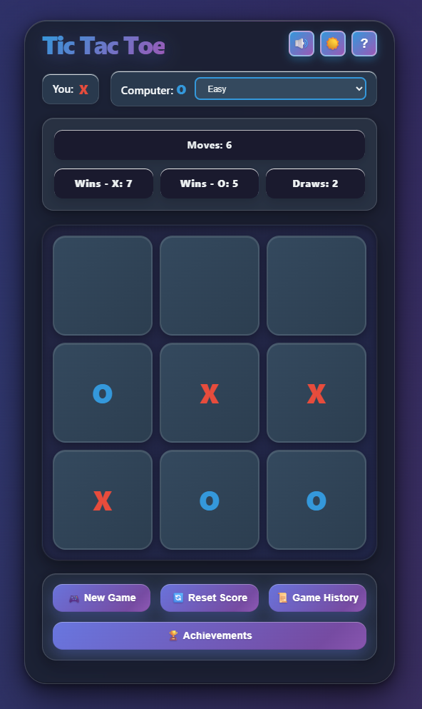
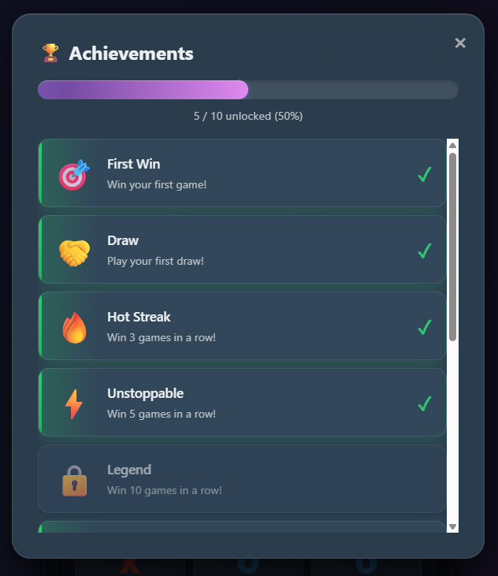

# 🎮 Tic Tac Toe - Modern Browser Game

A modern, interactive Tic Tac Toe game built with HTML, CSS, and JavaScript.

## ✨ Features

- **AI Opponent** with three difficulty levels (Easy, Medium, Hard/Unbeatable)
- **Achievements System** with 10 unlockable achievements
- **Game History** - saves and replay past games
- **Dark Mode** support
- **Sound Effects** with volume control
- **Responsive Design** for all devices
- **Keyboard Shortcuts** (1-9 for cells, R for new game, H for help)

## 🚀 Usage

Simply open `index.html` in a web browser.

## 🛠️ Development

The `screenshot_tool.py` script can be used to generate screenshots of the game (requires Python and Playwright). This is particularly useful for iterative UI improvements via Coding Agent, as it allows you to quickly capture and share the current state of the interface.

**Iterative Development Workflow:**
1. Capture screenshot → 2. Analyse screenshot → 3. Generate feedback → 4. Implement feedback → and so on...

## 📝 License

This project is licensed under the MIT License - see the [LICENSE](LICENSE) file for details.

## 📸 Images

